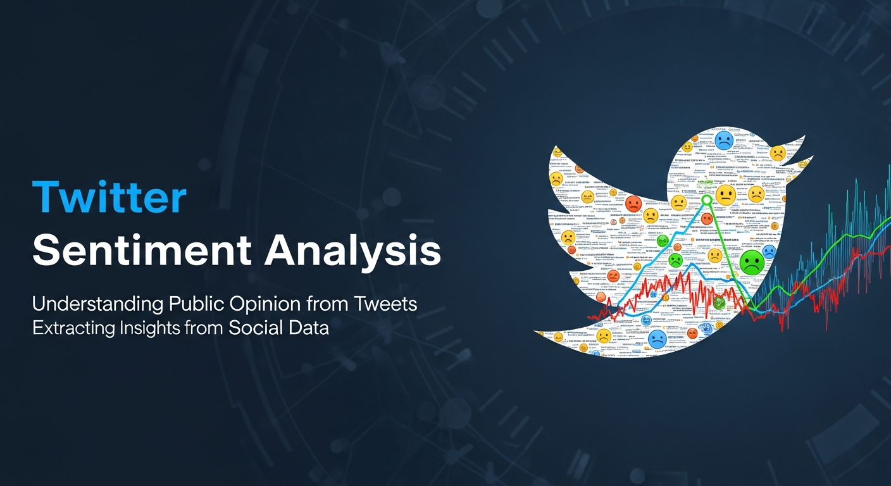
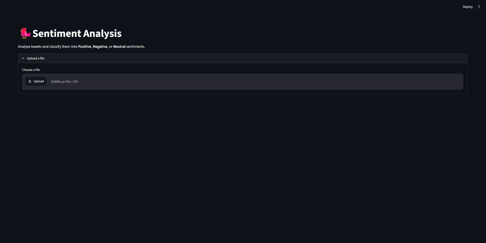
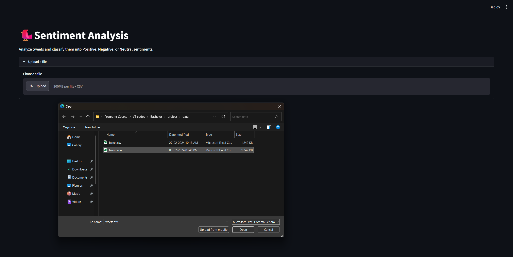
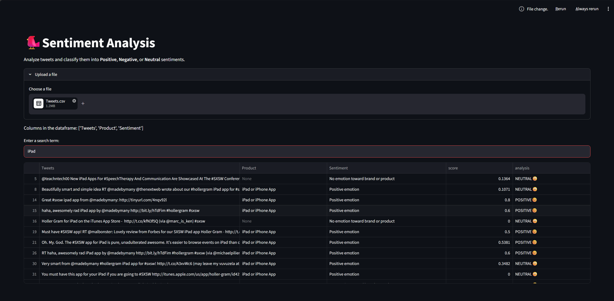
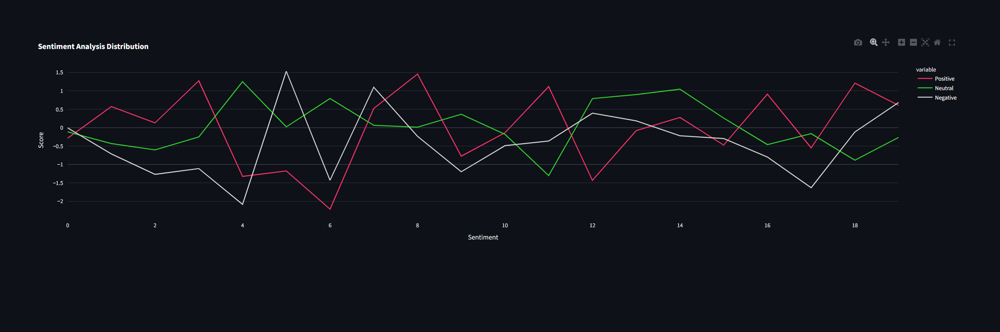
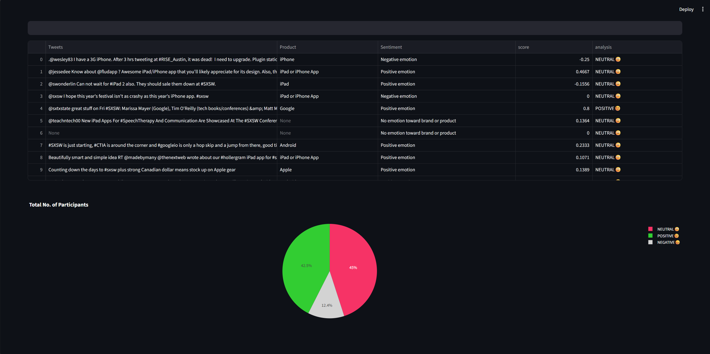

# 🐦 Tweet Sentiment Analysis & Visualization

<p align="center">
  
</p>
<p align="center">
An NLP-based web application for analyzing and visualizing tweet sentiments using Python, Streamlit, TextBlob, and Plotly.
</p>

<a id="overview"></a>

## 📖 Overview

Tweet Sentiment Analysis & Visualization is an NLP-based web application built using **Python**, **Streamlit**, **TextBlob**, **Pandas**, and **Plotly**.

The application enables users to upload tweet datasets, search tweets using keywords, classify sentiments into Positive, Neutral, and Negative categories, and visualize analytical insights through interactive charts in a clean web interface.

<div align="center">
  


</div>

## 📑 Table of Contents

- [📖 Overview](#overview)
- [✨ Features](#features)
- [🛠 Technology Stack](#technology-stack)
- [🔄 Application Workflow](#application-workflow)
- [📂 Project Structure](#project-structure)
- [🚀 Installation Guide](#installation-guide)
- [📸 Application Screenshots](#application-screenshots)
- [🚀 Future Enhancements](#future-enhancements)
- [👨‍💻 Author](#author)
- [📄 License](#license)

<a id="features"></a>
## ✨ Features

- 🔍 Search tweets using keywords
- 📂 Upload CSV datasets for analysis
- 😊 Perform sentiment analysis (Positive, Negative, Neutral)
- 📊 Interactive visualizations using Plotly
- 📈 Display sentiment distribution
- 🖥️ User-friendly web interface built with Streamlit


<a id="technology-stack"></a>
## 🛠 Technology Stack

| Category | Technologies |
|----------|--------------|
| Programming Language | Python |
| Web Framework | Streamlit |
| NLP Library | TextBlob |
| Data Processing | Pandas, NumPy |
| Visualization | Plotly |
| Version Control | Git, GitHub |

<a id="application-workflow"></a>

## 🔄 Application Workflow

The application follows a simple Natural Language Processing (NLP) workflow to analyze tweet sentiments.

```text
                 User
                   │
                   ▼
        Upload CSV Dataset
                   │
                   ▼
        Read Dataset using Pandas
                   │
                   ▼
      Search & Filter Tweets
                   │
                   ▼
 Analyze Sentiment using TextBlob
                   │
                   ▼
 Generate Interactive Charts
        (Plotly Visualizations)
                   │
                   ▼
 Display Results in Streamlit
```

### Workflow Explanation

1. **Upload Dataset**
   - The user uploads a CSV file containing tweets.

2. **Read Dataset**
   - Pandas loads and processes the dataset into a DataFrame.

3. **Search Tweets**
   - Users search tweets using keywords.
   - Matching tweets are filtered and displayed.

4. **Sentiment Analysis**
   - TextBlob calculates the sentiment polarity of each tweet.
   - Tweets are classified as Positive, Negative, or Neutral.

5. **Visualization**
   - Plotly generates interactive charts for sentiment analysis.

6. **Result Display**
   - Streamlit displays searchable data tables and visual analytics in a responsive web interface.

<a id="project-structure"></a>
## 📂 Project Structure

```text
tweet-analysis-streamlit/
│
├── assets/
│   ├── banner/
│   │   └── tweet-banner.png
│   │
│   ├── logo/
│   │   └── twitter-logo.png
│   │
│   └── screenshots/
│       ├── home-page.png
│       ├── upload-data.png
│       ├── search-feature.png
│       ├── pie-chart.png
│       └── line-chart.png
│
├── data/
│   ├── Tweet.csv
│   └── Tweets.csv
│
├── app.py
├── search.py
├── page_config.py
├── requirements.txt
├── README.md
├── LICENSE
└── .gitignore
```

<a id="installation-guide"></a>
## 🚀 Installation Guide

### Prerequisites

- Python 3.10+
- Git

### Clone Repository

```bash
git clone https://github.com/Saro-3/tweet-analysis-streamlit.git
cd tweet-analysis-streamlit
```

### Install Dependencies

```bash
pip install -r requirements.txt
```

### Run Application

```bash
streamlit run app.py
```

<a id="application-screenshots"></a>
## 📸 Application Screenshots

### 🏠 Home Page Interface

The landing page allows users to upload a CSV dataset and begin tweet sentiment analysis.

<p align="center">
  
</p>

---

### 📂 Upload Dataset

Users can upload tweet datasets in CSV format for processing and analysis.

<p align="center">
  
</p>

---

### 🔍 Search Tweets

Search functionality filters tweets based on user-entered keywords for quick exploration.

<p align="center">
  
</p>

---

### 📈 Sentiment Distribution Chart

Interactive line chart displaying sentiment trends across the analyzed tweets.

<p align="center">
  
</p>

---

### 🥧 Sentiment Distribution Pie Chart

Pie chart illustrating the percentage distribution of Positive, Neutral, and Negative sentiments.

<p align="center">
  
</p>

<a id="future-enhancements"></a>
## 🚀 Future Enhancements

The following improvements can further enhance the capabilities of this project:

- 🤖 Integrate advanced NLP models such as BERT or RoBERTa for improved sentiment classification.
- 🌐 Connect to the Twitter (X) API for real-time tweet analysis.
- 📊 Add an interactive analytics dashboard with additional visualization options.
- 📈 Support sentiment trend analysis over different time periods.
- 📄 Enable exporting analysis results as PDF or Excel reports.
- ☁️ Deploy the application using Streamlit Cloud, Render, or Docker.
- 🔍 Improve keyword search with fuzzy matching and advanced filtering.
- 🌍 Extend the application to support multilingual sentiment analysis.
- 🧠 Compare multiple machine learning and NLP models for sentiment prediction.
- 👥 Add user authentication to save analysis history and uploaded datasets.

<a id="author"></a>

## 👨‍💻 Author

**Saravanan Thangaraj**

**Software Engineer | Java Full-Stack Developer**

**Project:** Tweet Sentiment Analysis & Visualization

📧 **Email:** sharewithsaravanan@gmail.com

💼 **LinkedIn:** https://www.linkedin.com/in/imsaro28/

💻 **GitHub:** https://github.com/Saro-3

---

Thank you for visiting this repository.

If you found this project useful, feel free to ⭐ star the repository and share your feedback.

<a id="license"></a>
## 📄 License

This project is licensed under the **MIT License**.

See the **LICENSE** file for more information.
